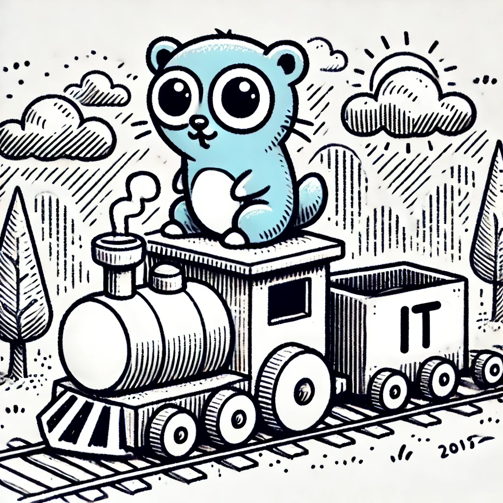

# it


[](https://goreportcard.com/report/github.com/kyminbb/it)

**:boom: `it` is a Go module that provides a variety of iterator building blocks, based on the Go 1.23+ iterators.**

It is entirely written in the Go standard library, making it lightweight and dependency-free.

It is inspired by the Rust [std::iter::Iterator](https://doc.rust-lang.org/std/iter/trait.Iterator.html) trait.

## Getting Started

### Installation

```bash
go get github.com/kyminbb/it
```

### Usage

```go
import "github.com/kyminbb/it"
```

See <https://pkg.go.dev/github.com/kyminbb/it> for the detailed usage doc and examples.

## Contributing

### Prerequisites

- [Go 1.23+](https://go.dev/doc/install)
- [Just](https://just.systems/man/en/chapter_1.html)

### Getting Started

- Fix [open issues](https://github.com/kyminbb/it/issues) or request new features
- Fork this repository to make changes
  - Run `just test` to run the tests

## License

See [LICENSE](LICENSE) (MIT).
